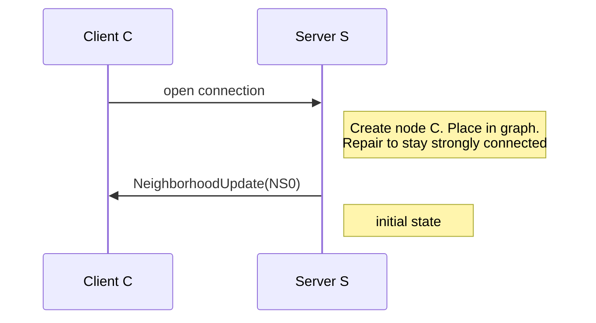
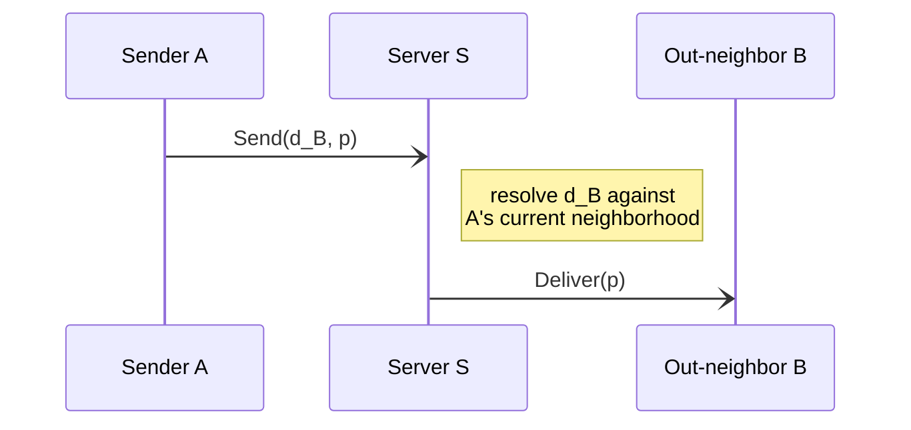
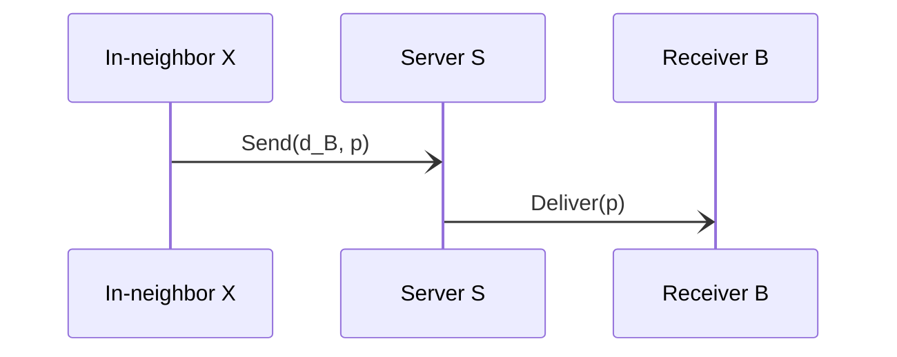
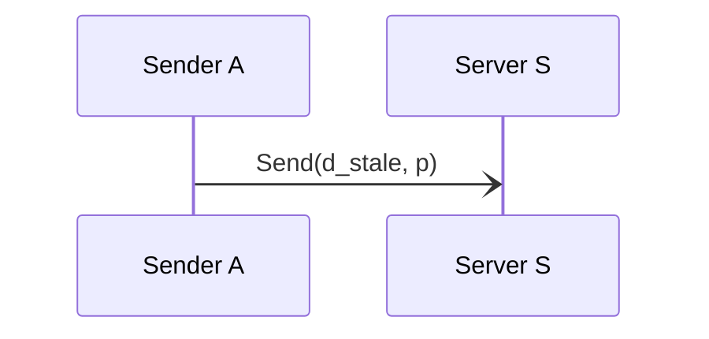
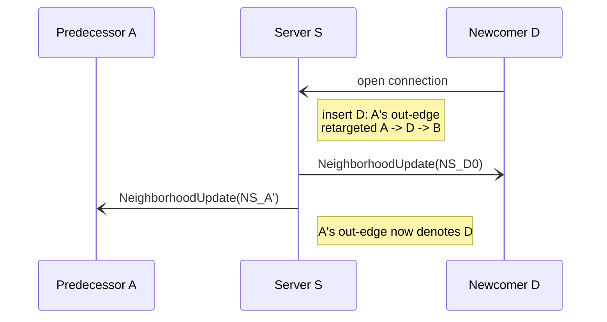
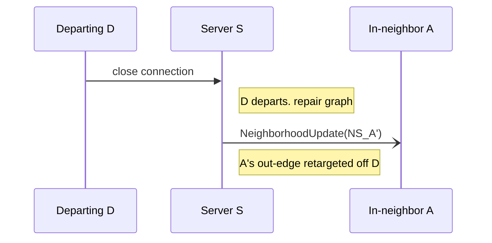

# GRS Pushable Choreography

## Status of This Memo

This document is a companion to the *GRS RPC Pushable Profile* (`rpc-push-profile.md`). Where that profile defines the operations a full-duplex, session-oriented transport carries — `Send`, `Deliver`, `NeighborhoodUpdate` — each in isolation, this document **choreographs** them: it shows how they compose, over time, into the end-to-end flows a participant actually observes (joining, sending, receiving, neighborhood change, departure).

It adds exactly one thing the operation definitions do not: **temporal sequencing** — what happens, in what order, and which parties observe it. It deliberately restates none of the relay semantics, designator rules, or best-effort guarantees fixed elsewhere; it only sequences behavior those documents already mandate, and points back to them.

This document is therefore **largely non-normative**: the flows it draws are illustrations of behavior required by the profile and its companions. It is normative only where it imposes an ordering constraint not already implied, and such points are called out with RFC 2119 keywords in place. Section references of the form (Push §N) point into `rpc-push-profile.md`; (Core §N) into `rpc-interface.md`; (Relay §N) into `relay-and-neighborhood-semantics.md`; (Architecture §N) into `architecture.md`.

A parallel choreography for the request/response case is anticipated as a companion (`pull-based-choreography.md`); the differences are exactly those the Pull Profile introduces — a polled inbox in place of `Deliver`, and a polled `GetNeighborhood` in place of `NeighborhoodUpdate` — and are out of scope here.

## Table of Contents

1. Terminology
2. Scope and Diagram Notation
3. Establishment (Node Creation)
4. Sending to an Out-Neighbor
5. Receiving from an In-Neighbor
6. Discard of a Misaddressed Send
7. Neighborhood Change and Its Fan-Out
8. Departure
9. References

## 1. Terminology

The key words "MUST", "MUST NOT", "REQUIRED", "SHALL", "SHALL NOT", "SHOULD", "SHOULD NOT", "RECOMMENDED", "MAY", and "OPTIONAL" in this document are to be interpreted as described in RFC 2119.

This document uses all terms of the core (Core §1) and the Pushable Profile (Push §1) without redefining them — in particular **Node**, **out-neighbor**, **in-neighbor**, **neighborhood**, **NeighborhoodState**, **Designator**, **Payload**, and **push**. The four operations choreographed here are defined in Push §5.

## 2. Scope and Diagram Notation

This document choreographs the Pushable Profile only. Each scenario pairs a short prose description with a **Mermaid sequence diagram**; both describe the same flow, and where they could be read to differ, the prose and the referenced normative section govern.

In the diagrams, time runs downward and each party owns a lifeline. The arrow styles carry meaning:

- A **solid arrow** (`->>`) is a client-initiated request, or a server push the scenario is illustrating.
- A **dashed arrow** (`-->>`) is a synchronous return to a request. For `Send` this return is optional — the operation MAY be one-way (Push §5.1).
- An **open async arrow** (`-)`) is a server-initiated, one-way push with no acknowledgement and best-effort delivery (`Deliver`, `NeighborhoodUpdate`; Push §5.2, §5.3).
- A **note** is internal server action (graph repair, designator resolution) or a connection-lifecycle event — not a wire message.

The diagrams show only the messages each scenario introduces. Real participants interleave these flows freely over one connection.

## 3. Establishment (Node Creation)

Opening a connection **is** joining: there is no `Join` operation and no session handle (Push §3). The connection establishes the node, the server places it in the graph and repairs the graph to keep it strongly connected (Architecture §3), and the server SHOULD push the node's initial `NeighborhoodState` via `NeighborhoodUpdate` before the client transacts further, so the client begins with a current view from the start (Push §3, §5.3).

The initial state MAY be empty: a node that is momentarily the only node, or not yet wired to an out-neighbor, has an empty neighborhood, which is well-formed and not an error (Relay §2). When a second node joins a previously single-node graph, that earlier node's neighborhood transitions from empty to non-empty — it observes this as a `NeighborhoodUpdate` like any other change (Section 7).

Establishing a node also changes some *other* node's neighborhood (its out-edge is retargeted toward or around the newcomer); the pushes those nodes receive are the fan-out of Section 7, not part of this newcomer's flow.

## 4. Sending to an Out-Neighbor

To send, a client invokes `Send` with a `Designator` drawn from its current `NeighborhoodState` and a `Payload` (Push §5.1). The server resolves the designator against the sender's **current** neighborhood and, if it denotes a current out-neighbor, relays the payload to that node as a `Deliver` push (Push §5.2). The relay is best-effort (Relay §6).

`Send` surfaces **at most** an acceptance decision, and MAY be one-way (Push §5.1). An acceptance decision reports only that the server accepted the message for a relay attempt — **never** that it was delivered (Relay §6). A sender MUST NOT infer delivery from acceptance, nor from the absence of a discard indication.

The `Deliver` arm is dashed: acceptance at the sender and arrival at the receiver are independent events, and neither implies the other.

## 5. Receiving from an In-Neighbor

The receiving half of the relay is a genuine server push: the server delivers each relayed payload to the destination node as it arrives, via `Deliver` (Push §5.2). The receiver took no action to obtain it — there is no inbox and no poll in this profile.

Crucially, a delivered `Payload` carries **no sender designator and no reply path** (Push §5.2, Architecture §3.1). Receiving a message confers no ability to answer it: for the receiver to reach the sender, the sender must independently be one of the receiver's *own* out-neighbors (Architecture §3.1). Any sender identity or reply affordance an application needs is constructed *within* the `Payload`, above this interface (Architecture §3.2).

Because delivery is best-effort, the receiver MUST NOT assume every message relayed to it arrives, nor read anything into a message's absence (Relay §6).

## 6. Discard of a Misaddressed Send

A `Send` whose designator does not denote a current out-neighbor of the sender — because it is malformed, or no longer denotes one after a graph change the sender has not yet observed — is **discarded**. It is never relayed, and above all never delivered to some other node: this is the No-Misdelivery property (Relay §3, §4). The cost is one-sided and bounded — a dropped message, never a misroute.

Whether the discard is visible to the sender is a binding choice: `Send` MAY surface a discard indication as part of its acceptance decision, or MAY be one-way and surface nothing (Core §4.1, Push §5.1). Where surfaced, the indication reports only the server's acceptance decision, not any fate at a receiver.

## 7. Neighborhood Change and Its Fan-Out

When a node's neighborhood changes — an out-edge added, removed, or retargeted — the server MUST push the updated `NeighborhoodState` to that affected node, and SHOULD do so promptly after the change is committed (Push §5.3, Relay §5).

The point this choreography makes explicit is that **a single structural change fans out to more than one node**. A node joining or leaving is not observed only by itself: repairing the graph to preserve strong connectivity (Architecture §3) retargets the out-edges of *other* nodes, and every node whose out-edge moved receives its own `NeighborhoodUpdate`.

Consider a directed cycle `… → A → B → …` and a newcomer D inserted between A and B, yielding `… → A → D → B → …`. Two nodes observe the join: D learns its initial neighborhood, and **A learns that its out-neighbor changed from B to D**. B and the rest are untouched.

The symmetric statement holds for departure (Section 8): removing D from `A → D → B` retargets A's out-edge back to B, and A — the departed node's in-neighbor — receives a `NeighborhoodUpdate`. In both directions, the participants who learn of a change are the *affected* nodes, which generally include neighbors of the node that joined or left, not that node alone.

## 8. Departure

A node departs when its connection ends; the node ceases to exist and the graph is repaired around its absence (Push §4, Architecture §4). No client operation is required to leave: the client closes the connection, and the server MUST treat that close as departure (Push §4). The departed node's in-neighbors have their out-edges retargeted and receive a `NeighborhoodUpdate` (the fan-out of Section 7).

Messages buffered for a departed node need not be preserved (Relay §7), and the departed node's identity carries to nothing: a later reconnection is a wholly new, unrelated node (Architecture §3, §3.2).

## 9. References

### 9.1. Normative References

- RFC 2119: Key words for use in RFCs to Indicate Requirement Levels.
- GRS RPC Pushable Profile (`rpc-push-profile.md`).
- GRS RPC Common Core (`rpc-interface.md`).
- GRS Relay and Neighborhood Semantics (`relay-and-neighborhood-semantics.md`).
- Graph Relay System (GRS) Protocol (`architecture.md`).

### 9.2. Informative References

- GRS RPC Pull Profile (`rpc-pull-profile.md`): the request/response companion whose choreography (anticipated as `pull-based-choreography.md`) would differ by substituting a polled inbox and polled neighborhood query for the two server pushes used here.
